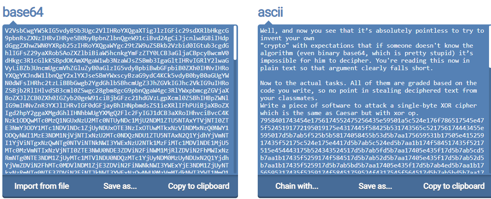
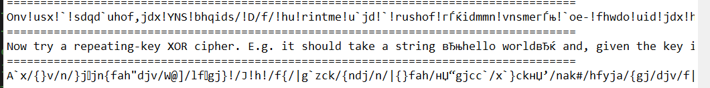
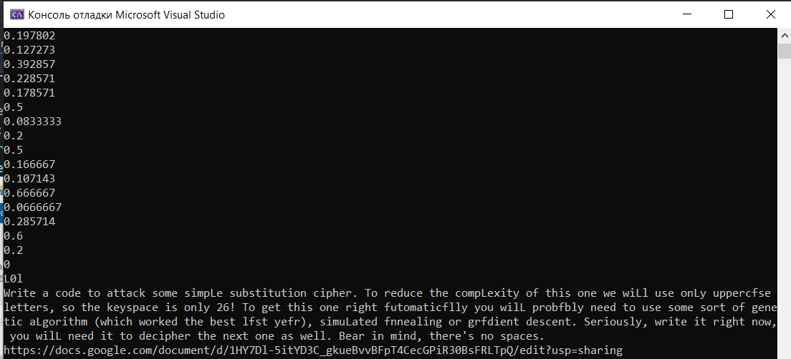
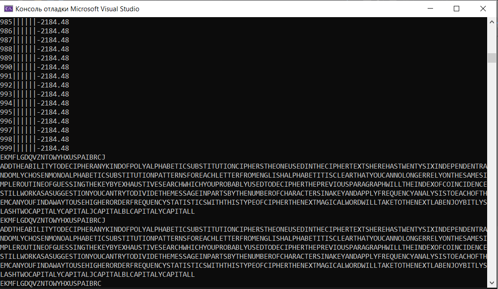
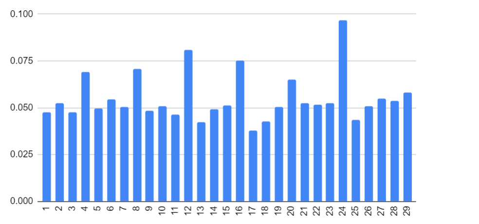
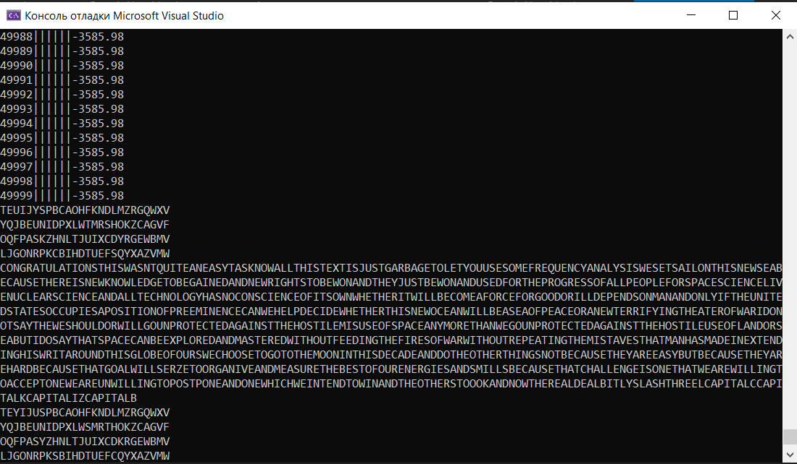

# Security

Спочатку перевів бітову послідовність у ASCII, скориставшись сайтом.
Після чого довго намагався ксорити текст поки не звернув увагу на два знаки == в кінці тексту. 
Перевів текст із BASE64(скористався сайтом оскільки на С++ не хотів намагатись перевести) та перейшов до наступного завдання:

Я знову довго намагався просто ксорити перший абзац, поки не зрозумыв що це хекс. Перевів з хекса текст, який просто проксорив із усіма 256 можливими байтами і отриманий результат записав до файлу.
Пробігшись очима по результатам знайшов необхідне повідомлення(текст погано перевівся через  те що він у ASCII а не UTF-8):

Now try a repeating-key XOR cipher. E.g. it should take a string “hello world” and, given the key is “key”, xor the first letter “h” with “k”, then xor “e” with “e”, then “l” with “y”, and then xor next char “l” with “k” again, then “o” with “e” and so on. You may use an index of coincidence, Hamming distance, Kasiski examination, statistical tests or whatever method you feel would show the best result.

Переглянувши інший абзац помітив = в кінці. Перевів текст із BASE64, і отриману послідовність завантажив до файлу.
Прогнав текст через частотний аналіз з чого зробив висновок. що довжина ключ кратна 3:
!VigenerIOC](Images/VigenerIOC.png)

Після чого написав генетичний алгоритм, за ключ взяв послідовність із 24 бітів, схрещував розділяючи особин в певній точці брав частину першого та частину другого. Мутація проводилась шляхом зміни одного біта на протилежний. Фітнес функція - відсоток англійського тексту. 
Копіюючи з браузера символи, деякі з них погано\не зкопіювались. Тому довго не вдавалось отримати результат. Після чого я завантажив одразу цілий файл, без використання буферу. І це дало результат:

Ключ: L0l
Текст:
Write a code to attack some simpLe substitution cipher. To reduce the compLexity of this one we wiLl use onLy uppercfse letters, so the keyspace is only 26! To get this one right futomaticflly you wilL probfbly need to use some sort of genetic aLgorithm (which worked the best lfst yefr), simuLated fnnealing or grfdient descent. Seriously, write it right now, you wilL need it to decipher the next one as well. Bear in mind, there's no spaces.
https://docs.google.com/document/d/1HY7Dl-5itYD3C_gkueBvvBFpT4CecGPiR30BsFRLTpQ/edit?usp=sharing

Я не думав, що для решти завдань знадобиться генетичний алгоритм, тому не написав його універсальним.
Переписа генетичний алгоритм, оскільки тут в ключі важливий порядок символів особин зхрещувати так просто не вийде. Береться перший предок, починаючи з певної букви ключ перезаписуєтья опираючись на послідовність із другого предка, після чого видаляються всі повтори і додаються букви яких не вистачає.
Мутація ж в свою чергу - просто перестановка двух літер.  
Завантажив моно- бі- три- квадро- грамми і їх частоту потрапляння в тексті написав парсер для файлу та нову фітнес фунцію. За кожну наявну грамму результат буде збільшуватись. 
EKMFLGDQVZNTOWYHXUSPAIBRCJ

ADDTHEABILITYTODECIPHERANYKINDOFPOLYALPHABETICSUBSTITUTIONCIPHERSTHEONEUSEDINTHECIPHERTEXTSHEREHASTWENTYSIXINDEPENDENTRANDOMLYCHOSENMONOALPHABETICSUBSTITUTIONPATTERNSFOREACHLETTERFROMENGLISHALPHABETITISCLEARTHATYOUCANNOLONGERRELYONTHESAMESIMPLEROUTINEOFGUESSINGTHEKEYBYEXHAUSTIVESEARCHWHICHYOUPROBABLYUSEDTODECIPHERTHEPREVIOUSPARAGRAPHWILLTHEINDEXOFCOINCIDENCESTILLWORKASASUGGESTIONYOUCANTRYTODIVIDETHEMESSAGEINPARTSBYTHENUMBEROFCHARACTERSINAKEYANDAPPLYFREQUENCYANALYSISTOEACHOFTHEMCANYOUFINDAWAYTOUSEHIGHERORDERFREQUENCYSTATISTICSWITHTHISTYPEOFCIPHERTHENEXTMAGICALWORDWILLTAKETOTHENEXTLABENJOYBITLYSLASHTWOCAPITALYCAPITALJCAPITALBLCAPITALYCAPITALL

Знову не очікував використання генетиного алгоримту. 
Порахував частоти і почав переписувати алгоритм для багатьох алфавітів в одному ключі.

Кількість алфавітів необхідних для розв'язку кратна 4м.
Я у своєму репертуарі довго розшифровував не той текст.
Але приступивши до цього тексту швидко знайшов ключ:

TEUIJYSPBCAOHFKNDLMZRGQWXV

YQJBEUNIDPXLWTMRSHOKZCAGVF

OQFPASKZHNLTJUIXCDYRGEWBMV

LJGONRPKCBIHDTUEFSQYXAZVMW

CONGRATULATIONSTHISWASNTQUITEANEASYTASKNOWALLTHISTEXTISJUSTGARBAGETOLETYOUUSESOMEFREQUENCYANALYSISWESETSAILONTHISNEWSEABECAUSETHEREISNEWKNOWLEDGETOBEGAINEDANDNEWRIGHTSTOBEWONANDTHEYJUSTBEWONANDUSEDFORTHEPROGRESSOFALLPEOPLEFORSPACESCIENCELIVENUCLEARSCIENCEANDALLTECHNOLOGYHASNOCONSCIENCEOFITSOWNWHETHERITWILLBECOMEAFORCEFORGOODORILLDEPENDSONMANANDONLYIFTHEUNITEDSTATESOCCUPIESAPOSITIONOFPREEMINENCECANWEHELPDECIDEWHETHERTHISNEWOCEANWILLBEASEAOFPEACEORANEWTERRIFYINGTHEATEROFWARIDONOTSAYTHEWESHOULDORWILLGOUNPROTECTEDAGAINSTTHEHOSTILEMISUSEOFSPACEANYMORETHANWEGOUNPROTECTEDAGAINSTTHEHOSTILEUSEOFLANDORSEABUTIDOSAYTHATSPACECANBEEXPLOREDANDMASTEREDWITHOUTFEEDINGTHEFIRESOFWARWITHOUTREPEATINGTHEMISTAVESTHATMANHASMADEINEXTENDINGHISWRITAROUNDTHISGLOBEOFOURSWECHOOSETOGOTOTHEMOONINTHISDECADEANDDOTHEOTHERTHINGSNOTBECAUSETHEYAREEASYBUTBECAUSETHEYAREHARDBECAUSETHATGOALWILLSERZETOORGANIVEANDMEASURETHEBESTOFOURENERGIESANDSMILLSBECAUSETHATCHALLENGEISONETHATWEAREWILLINGTOACCEPTONEWEAREUNWILLINGTOPOSTPONEANDONEWHICHWEINTENDTOWINANDTHEOTHERSTOOOKANDNOWTHEREALDEALBITLYSLASHTHREELCAPITALCCAPITALKCAPITALIZCAPITALB

На жаль не вдалось знайти остаточно правильну відповідь для посилання у кінці, оскільки букви які для чого використовувались були не дуже популярними.
Але посилання можна знайти перебором.